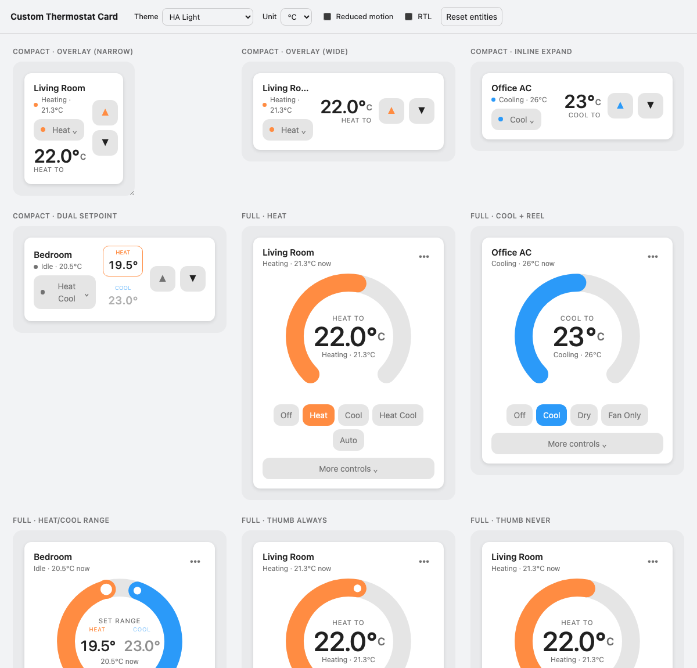
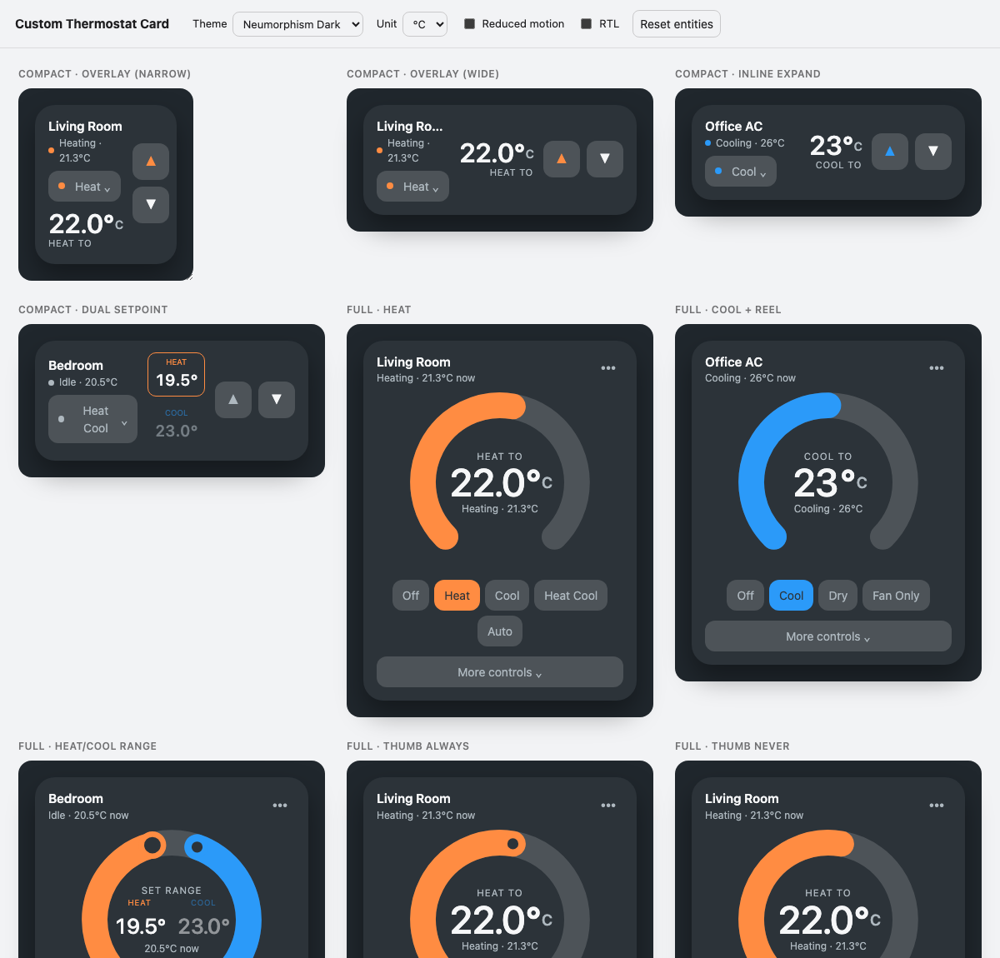

# Custom Thermostat Card

An Apple-Home–inspired thermostat card for Home Assistant Lovelace. It is
**generic and theme-driven** — Home Assistant stays the source of truth for
light/dark mode, colours, radius and shadows. Works with `climate` and
`water_heater` entities.





<sub>Screens from the bundled browser preview (`npm run preview`): compact tiles, the full horseshoe, dual-setpoint, water heater, and the thumb modes.</sub>

- **Adaptive compact tile** — square at narrow grid widths, horizontal when
  wider, with persistent `▲` / `▼` steppers. Never a shrunken dial.
- **Full horseshoe dial** — draggable by pointer, touch, stylus and keyboard.
- **Three presentations** — compact → overlay, compact → inline, or full from
  the start.
- **Dual-setpoint** heat/cool with two non-crossing targets.
- **Odometer / reel** number animations, entity-defined precision & step,
  `prefers-reduced-motion` aware.
- **Progressive "More controls"** for preset / fan / swing / away — only what
  the entity advertises.
- Self-contained: one bundled asset, no runtime dependencies, no `browser_mod`.
- Accessible overlay: focus trap, Escape / backdrop close, focus restore.
- card-mod friendly via `--atc-*` CSS variables and `part` attributes.

> Status: first implementation. Domain logic and geometry are unit-tested; the
> visual/interaction matrix is verified with the bundled browser preview
> (`npm run preview`). Not yet published to a HACS default repository.

## Install

### HACS (custom repository)

1. HACS → **⋮** → **Custom repositories**.
2. Add `https://github.com/alws34/custom-thermostat-card` with type **Dashboard**
   (older HACS calls this "Lovelace" / "Plugin").
3. Install **Custom Thermostat Card**.
4. HACS adds the dashboard resource automatically. If you manage resources
   manually, add:

   ```yaml
   url: /hacsfiles/custom-thermostat-card/custom-thermostat-card.js
   type: module
   ```

### Manual

1. Download `custom-thermostat-card.js` from the
   [latest release](https://github.com/alws34/custom-thermostat-card/releases).
2. Copy it to `<config>/www/`.
3. Settings → Dashboards → **⋮** → Resources → **Add resource**:

   ```yaml
   url: /local/custom-thermostat-card.js
   type: module
   ```

## Configuration

Add the card from the picker ("Custom Thermostat Card") or in YAML:

```yaml
type: custom:custom-thermostat-card
entity: climate.living_room
```

The visual editor is capability-aware once an entity is chosen: options that do
not apply are hidden with a short explanation, and unknown keys survive editor
round-trips.

### Options

| Option                    | Type    | Default        | Description |
| ------------------------- | ------- | -------------- | ----------- |
| `entity`                  | string  | **required**   | A `climate.*` or `water_heater.*` entity. |
| `name`                    | string  | entity name    | Override the displayed name. |
| `display`                 | string  | `compact`      | `compact` or `full`. |
| `open_behavior`           | string  | `overlay`      | For compact: `overlay` or `inline`. |
| `dial_style`              | string  | `arc`          | Full-display control look: `arc`, `ticks`, `gradient`, `thermometer`, `minimal`. |
| `thumb`                   | string  | `interaction`  | `interaction`, `always` or `never` (applies to `arc` / `minimal`). |
| `number_animation`        | string  | `odometer`     | `odometer` or `reel` — both now render a continuous linear count. |
| `show_current_as_primary` | boolean | `false`        | Emphasise the current temperature instead of the target. |
| `secondary_controls`      | boolean | `true`         | Show the progressive "More controls" section. |
| `appearance`              | string  | `auto`         | `auto` follows HA dark mode; `light` / `dark` force it. |
| `theme`                   | string  | –              | Standard Home Assistant per-card theme override. |

`dial_style` only affects the `full` display — the compact tile never draws a
dial. Every style supports single and dual-setpoint (heat/cool) entities,
`water_heater`, keyboard control and `show_current_as_primary`.

All motion is linear and continuous: the readout tracks toward its target at a
constant rate and never snaps, so during a drag the number trails the finger.
Under `prefers-reduced-motion` values update instantly.

`auto` in `thumb` is not a value — `auto` HVAC mode refers to the device's own
automatic operation and is distinct from `heat_cool`.

### Examples

See [`examples/dashboard.yaml`](examples/dashboard.yaml). A few:

```yaml
# Compact tile, expands inline
type: custom:custom-thermostat-card
entity: climate.bedroom
display: compact
open_behavior: inline
```

```yaml
# Full display, graduated tick ring
type: custom:custom-thermostat-card
entity: climate.office
display: full
dial_style: ticks
```

```yaml
# Full display, vertical thermometer, current temperature emphasised
type: custom:custom-thermostat-card
entity: climate.living_room
display: full
dial_style: thermometer
show_current_as_primary: true
```

## Theming & card-mod

The card renders a real `ha-card` and reads Home Assistant theme variables
(`--ha-card-background`, `--primary-text-color`, `--divider-color`,
`--ha-card-border-radius`, `--state-climate-*-color`, …) with sensible
fallbacks. It does **not** require the Neumorphism theme or card-mod.

### CSS variables

| Variable | Purpose |
| -------- | ------- |
| `--atc-heat` / `--atc-cool` / `--atc-dry` / `--atc-fan` | HVAC activity colours |
| `--atc-idle` / `--atc-off` / `--atc-unavailable` | inactive states |
| `--atc-track` | dial track colour |
| `--atc-track-width` | dial stroke width (default `14`) |
| `--atc-dial-size` | dial diameter (default `220px`) |
| `--atc-roll-duration` | number-roll duration (forced to `0` under reduced motion) |
| `--atc-radius` | card corner radius |
| `--atc-focus` | focus ring colour |

### `part` hooks

`card`, `header`, `status`, `overflow`, `compact`, `readout`, `steppers`,
`dial`, `dial-track`, `dial-arc`, `dial-thumb`, `dial-readout`, `modes`,
`mode-row`, `mode-option`, `mode-menu`, `advanced-toggle`, `advanced-sheet`,
`advanced-row`, `inline`, `panel`, `backdrop`.

### card-mod example

```yaml
type: custom:custom-thermostat-card
entity: climate.living_room
display: full
card_mod:
  style: |
    ha-card {
      --atc-heat: #e0553b;
      --atc-cool: #1f8fd6;
      --atc-dial-size: 260px;
      --atc-track-width: 16;
    }
    atc-full::part(status) { font-weight: 600; }
    atc-full::part(dial-thumb) { stroke-width: 4; }
```

## Accessibility

- Full mouse / touch / stylus / keyboard operation. Arrow keys adjust the
  selected target by the entity step; the dial is a `role="slider"` with
  `aria-valuemin/max/now/text`.
- 44×44 CSS px minimum interactive targets (the visual thumb stays small).
- Page scroll is only suppressed once a gesture is recognised as a dial drag.
- Reduced motion updates values instantly; meaning never depends on animation.
- Unavailable entities stay legible and non-interactive but still open native
  more-info.

## Development

```bash
npm install
npm run build        # dist/custom-thermostat-card.js
npm test             # vitest: config, adapters, controller, geometry
npm run typecheck
npm run lint
npm run preview      # build + serve the browser preview on :4173
```

The preview harness (`preview/`) mocks just enough of Home Assistant to run the
real bundle against fixture entities across themes, sizes, reduced motion and
RTL. `node scripts/build-preview.mjs` inlines everything into
`preview/standalone.html`.

## Release process

1. Update `CHANGELOG.md` and bump `version` in `package.json`.
2. `git tag vX.Y.Z && git push --tags`.
3. The **Release** workflow builds and attaches `custom-thermostat-card.js`
   to the GitHub release; HACS serves that asset.

## License

[MIT](LICENSE) © alws34

Interaction inspired by Apple Home; no Apple artwork or trade dress is used.
Home Assistant theming is the visual authority.
